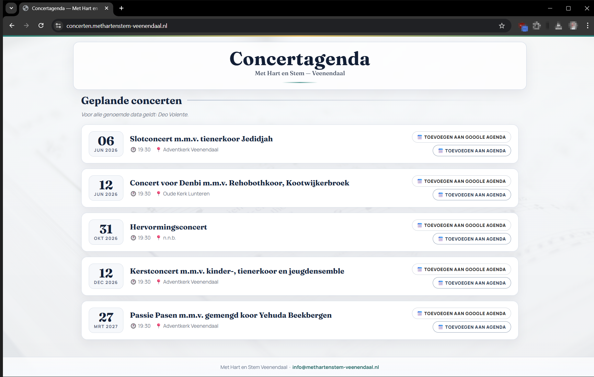
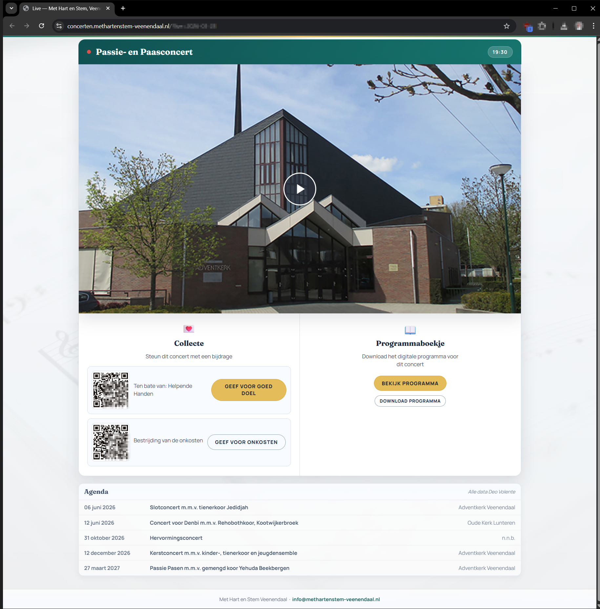

# 🎶 Met Hart en Stem, concerten

Welkom op de officiële concertwebsite van **Christelijk gemengd koor Met Hart en Stem (Veenendaal)**.

👉 **Live website:** https://concerten.methartenstem-veenendaal.nl/

---

## ✨ Over deze site

Deze website is een centrale plek voor alles rondom onze concerten en uitvoeringen.  
Bezoekers vinden hier eenvoudig:

- 📅 Concertagenda
- 📍 Locaties en tijden
- 🎼 Programma-informatie

---

## 🖼️ Preview

> Voeg hieronder screenshots toe van de website

### Homepage

### Concertpagina

---

## 🎤 Over het koor

**Met Hart en Stem** is een reformatorisch gemengd koor uit Veenendaal, opgericht in 1975.  
Het koor zingt psalmen en geestelijke liederen met orgelbegeleiding en incidenteel andere instrumentale ondersteuning.

---

## 📍 Concertlocaties

Concerten worden doorgaans uitgevoerd in:
- Adventkerk Veenendaal
- Kerken in Veenendaal en omgeving

---

## ⚙️ Techniek

Deze site is opgebouwd als een statische GitHub Pages website:

- HTML / CSS / JavaScript
- GitHub Pages hosting
- Git-based workflow
- Lichtgewicht en snel te laden
